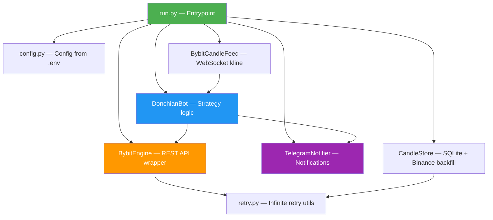
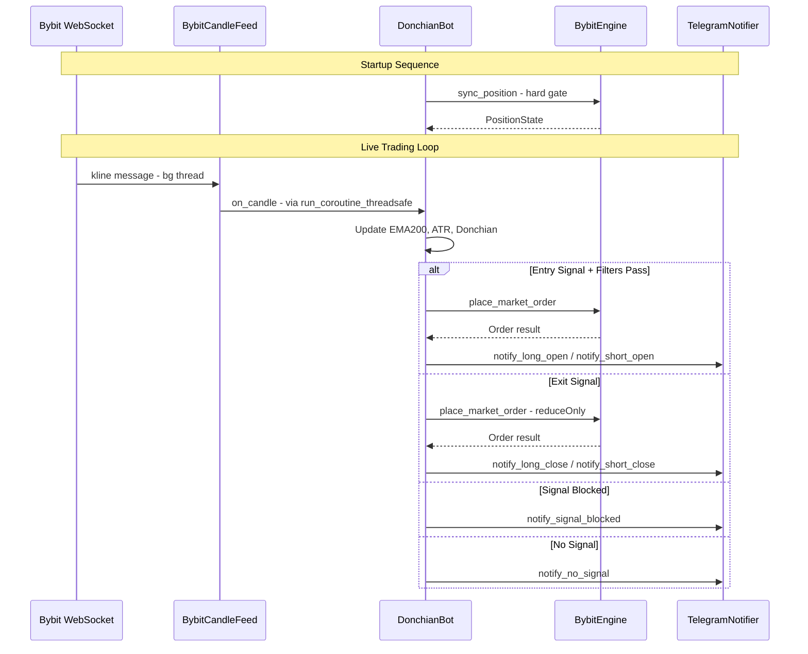

# Donchian Live Bot — Architecture & Security Audit

**Дата:** 2026-03-22  
**Версия:** Initial Review

---

## 1. Общая оценка архитектуры

### 1.1 Структура проекта



### 1.2 Что сделано хорошо ✅

| Аспект | Детали |
|--------|--------|
| **Разделение ответственности** | Чёткое разделение: engine, feed, strategy, notifier, retry — каждый модуль отвечает за одно |
| **Infinite retry с backoff** | Все API-вызовы обёрнуты в `retry_sync` с экспоненциальным backoff до 15 минут |
| **Idempotent orders** | `orderLinkId` через UUID предотвращает дублирование ордеров при retry |
| **Hard gates на старте** | Бот отказывается запускаться без готовых индикаторов и синхронизированной позиции |
| **WebSocket health monitor** | Автоматическое обнаружение обрыва и переподключение |
| **Уведомления о каждом действии** | Telegram: открытие, закрытие, блокировка сигнала, ошибки, retry, recovery |
| **Graceful shutdown** | Обработка SIGINT/SIGTERM, корректное закрытие ресурсов |
| **Rotating log files** | 10MB × 3 backup — лог не растёт бесконечно |
| **Position state before notify** | Состояние обновляется ДО уведомления — исключает десинк при сбое Telegram |
| **Gap-aware candle store** | Строгая проверка непрерывности исторических данных |

### 1.3 Архитектурная диаграмма потока данных



---

## 2. 🔴 КРИТИЧЕСКИЕ УЯЗВИМОСТИ

### 2.1 КРИТИЧНО: API ключи в открытом виде в репозитории

**Файл:** `key.txt` — содержит реальные API credentials в plain text.

```
hIFKqpS6mOQ7SGA6A6
D8068eO4YdTDRs2VL57wjMFfaqvfeSHUeCuM
```

**Проблема:** Хотя `key.txt` указан в `.gitignore`, это:
- **Если файл был закоммичен до добавления в .gitignore** — ключи уже в истории git
- Файл доступен локально любому, кто имеет доступ к машине
- Нет шифрования, нет vault, нет защиты

**Рекомендация:**
1. **НЕМЕДЛЕННО отозвать и пересоздать эти API ключи на Bybit**
2. Проверить git history: `git log --all --full-history -- key.txt`
3. Если ключи были закоммичены — использовать `git filter-branch` или `BFG Repo-Cleaner`
4. Удалить файл `key.txt` полностью — использовать только `.env`
5. Рассмотреть использование secret manager (e.g., `keyring`, HashiCorp Vault)

**Severity: 🔴 CRITICAL**

---

### 2.2 КРИТИЧНО: Отсутствие валидации env-переменных при парсинге

**Файл:** [`config.py:46-52`](config.py:46)

```python
leverage       = int(os.getenv("LEVERAGE", "3")),
trade_fraction = float(os.getenv("TRADE_FRACTION", "1.0")),
```

**Проблема:** Если в `.env` записано `LEVERAGE=abc` — бот падает с `ValueError` без внятного сообщения. Нет валидации диапазонов:
- `LEVERAGE` может быть 0, отрицательным или 125x
- `TRADE_FRACTION` может быть > 1.0 или отрицательным
- `N_PERIOD` / `M_PERIOD` могут быть 0 или отрицательными

**Рекомендация:** Добавить валидацию в `load_config()`:
- `leverage`: 1–100
- `trade_fraction`: 0.01–1.0
- `n_period` / `m_period`: > 0, n_period > m_period
- При невалидных значениях — `sys.exit(1)` с понятным сообщением

**Severity: 🔴 CRITICAL** (может привести к потере средств при некорректных параметрах)

---

### 2.3 КРИТИЧНО: Position state desync после неудачного ордера

**Файл:** [`donchian_live.py:305-341`](donchian_live.py:305)

```python
async def _open_long(self, price: float, high_n: float) -> None:
    try:
        ...
        await self.engine.place_market_order(...)
        # State updated AFTER order — but what if order partially fills?
        self._position     = "LONG"
        self._position_qty = qty
        self._entry_price  = price  # ← uses candle close, NOT actual fill price
    except Exception as exc:
        # position stays "NONE" — but order might have been placed!
        await self.notifier.notify_error("open_long", str(exc))
```

**Проблемы:**
1. **`_entry_price = price`** использует цену закрытия свечи, а не реальную цену исполнения ордера. Для market order с проскальзыванием это неверно
2. **Если `place_market_order` выбрасывает исключение ПОСЛЕ того как ордер исполнился на бирже** (timeout на HTTP response) — бот думает что позиции нет, но на бирже она есть
3. **Нет periodic position sync** — если состояние рассинхронизируется, оно остаётся таким навсегда

**Рекомендация:**
1. Получать `avgPrice` из ответа ордера или из `get_position()` после исполнения
2. После каждого ордера (или в catch) делать `sync_position()` для гарантии консистентности
3. Добавить периодический `sync_position()` каждые N свечей как safety net

**Severity: 🔴 CRITICAL** (может привести к двойным позициям или неуправляемым позициям)

---

## 3. 🟠 СЕРЬЁЗНЫЕ ПРОБЛЕМЫ

### 3.1 Нет stop-loss / risk management

**Файл:** [`donchian_live.py`](donchian_live.py)

Бот полагается ТОЛЬКО на Donchian exit channel (`M_PERIOD`). При `M_PERIOD=23` и часовых свечах, exit сигнал может прийти через 23+ часа. За это время при резком движении рынка убыток может быть катастрофическим.

**Рекомендация:**
1. Добавить server-side stop-loss через Bybit Conditional Order при открытии позиции
2. Добавить `MAX_LOSS_PERCENT` параметр — принудительное закрытие при превышении
3. Добавить `MAX_DRAWDOWN_USDT` — остановка бота при критическом убытке

**Severity: 🟠 HIGH**

---

### 3.2 TRADE_FRACTION=1.0 по умолчанию — 100% баланса

**Файл:** [`config.py:24`](config.py:24), [`donchian_live.py:308-310`](donchian_live.py:308)

```python
trade_fraction: float = 1.0  # доля свободного баланса на сделку
...
margin = balance * self.TRADE_FRACTION  # = 100% balance
notional = margin * self.cfg.leverage   # = 300% при leverage=3
```

По умолчанию бот использует 100% баланса × leverage на каждую сделку. Одна неудачная сделка с высоким leverage может привести к ликвидации.

**Рекомендация:** Изменить дефолт на 0.5 (50%) и добавить warning при `TRADE_FRACTION > 0.9`.

**Severity: 🟠 HIGH**

---

### 3.3 Telegram bot token в URL без rate limiting

**Файл:** [`notifier.py:17`](notifier.py:17)

```python
self._url = f"https://api.telegram.org/bot{bot_token}/sendMessage"
```

- Telegram Bot API имеет лимит ~30 сообщений/сек на бота. При массовых retry-уведомлениях бот может быть заблокирован
- Нет rate limiting на стороне приложения

**Рекомендация:** Добавить простой rate limiter — max 1 сообщение в секунду с очередью.

**Severity: 🟠 MEDIUM**

---

### 3.4 SQLite без WAL mode и без connection pooling

**Файл:** [`candle_store.py:58`](candle_store.py:58)

```python
self._conn = sqlite3.connect(self._db_path)
```

- Нет `journal_mode=WAL` — при конкурентном доступе возможны блокировки
- Нет `timeout` параметра — при блокировке бот зависнет
- `prepare()` запускается в executor, а основной поток может обращаться к той же БД

**Рекомендация:**
```python
self._conn = sqlite3.connect(self._db_path, timeout=30.0)
self._conn.execute("PRAGMA journal_mode=WAL")
```

**Severity: 🟠 MEDIUM**

---

### 3.5 Binance API используется для данных, Bybit — для торговли

**Файл:** [`candle_store.py:29`](candle_store.py:29)

```python
BINANCE_KLINES_URL = "https://fapi.binance.com/fapi/v1/klines"
```

Исторические свечи загружаются с Binance Futures, а торговля идёт на Bybit. Цены могут незначительно отличаться между биржами, что может приводить к:
- Неточным значениям EMA200, ATR при инициализации
- Ложным breakout сигналам на стыке исторических/live данных

**Рекомендация:** Использовать Bybit Kline API для исторических данных — `GET /v5/market/kline` с пагинацией.

**Severity: 🟠 MEDIUM**

---

## 4. 🟡 СРЕДНИЕ ПРОБЛЕМЫ

### 4.1 Hardcoded QTY_STEP для ETHUSDT

**Файл:** [`donchian_live.py:44`](donchian_live.py:44)

```python
QTY_STEP = 0.01
```

Если бот будет использоваться с другим `SYMBOL`, step size будет неверным. Например, для BTCUSDT step = 0.001.

**Рекомендация:** Загружать `qtyStep` из Bybit API `get_instruments_info()` при старте.

**Severity: 🟡 MEDIUM**

---

### 4.2 _position хранит строку вместо PositionState

**Файл:** [`donchian_live.py:83`](donchian_live.py:83)

```python
self._position: str = "NONE"  # "LONG" / "SHORT" / "NONE"
```

А в [`run.py:132`](run.py:132) используется как `PositionState`:

```python
pos = bot._position  # это строка "NONE"
if pos.side == "NONE":  # AttributeError!
```

Это **runtime bug** — `bot._position` это `str`, а код обращается к `pos.side`, `pos.unrealised_pnl`, `pos.avg_price`, `pos.size`. При запуске бота без открытой позиции это упадёт с `AttributeError`.

**Рекомендация:** Хранить `PositionState` объект вместо отдельных полей, или исправить код в `run.py`.

**Severity: 🔴 CRITICAL BUG — бот не запустится при отсутствии позиции**

---

### 4.3 Нет проверки минимального размера ордера

**Файл:** [`donchian_live.py:314-316`](donchian_live.py:314)

```python
if qty <= 0:
    logger.warning("Insufficient balance for LONG")
    return
```

Проверяется только `qty <= 0`, но Bybit имеет минимальный размер ордера (для ETHUSDT — 0.01 ETH). Если баланс очень маленький, ордер может быть отклонён биржей.

**Рекомендация:** Проверять `qty >= QTY_STEP` и добавить минимальный notional check.

**Severity: 🟡 MEDIUM**

---

### 4.4 Отсутствие health check endpoint

Бот работает как long-running process, но нет:
- HTTP health endpoint для мониторинга (e.g., Prometheus, healthcheck)
- Heartbeat в Telegram (периодическое "бот жив" сообщение)
- Watchdog mechanism для автоматического перезапуска

**Рекомендация:** Добавить периодический heartbeat в Telegram каждые N часов и/или HTTP health endpoint.

**Severity: 🟡 MEDIUM**

---

### 4.5 Нет ограничения на максимальное количество retry

**Файл:** [`retry.py:49`](retry.py:49)

```python
while True:  # бесконечный цикл
```

Retry бесконечный по дизайну, но для некоторых операций это нежелательно. Если Bybit полностью недоступен в течение суток, бот будет молча ретраить вместо того чтобы сообщить о критической ситуации.

**Рекомендация:** Добавить escalation: после N ретраев или M минут — отправить усиленное уведомление "CRITICAL: API недоступен > 1 час".

**Severity: 🟡 MEDIUM**

---

## 5. 🔵 НИЗКИЕ ПРОБЛЕМЫ / УЛУЧШЕНИЯ

| # | Проблема | Файл | Описание |
|---|----------|------|----------|
| 5.1 | Нет type hints для return values в некоторых методах | `candle_store.py` | `_insert_candles` возвращает `int`, но не аннотирован |
| 5.2 | `import math` внутри функции | `donchian_live.py:495` | `_round_qty` импортирует math при каждом вызове — вынести наверх |
| 5.3 | `from retry import _notify_sync` внутри цикла | `candle_store.py:239` | Повторный import в loop — вынести наверх |
| 5.4 | Нет `__all__` в модулях | Все файлы | Усложняет понимание публичного API каждого модуля |
| 5.5 | Логи на смеси русского и английского | Все файлы | Рекомендуется единый язык для grep/поиска |
| 5.6 | Нет unit tests | — | Отсутствует полностью тестовое покрытие |
| 5.7 | Нет Dockerfile / docker-compose | — | Для production deployment нужна контейнеризация |
| 5.8 | `DB_PATH` не в `.env.example` | `.env.example` | Параметр есть в config но не в шаблоне |

---

## 6. Сводная таблица находок

| # | Severity | Категория | Описание | Файл |
|---|----------|-----------|----------|------|
| 2.1 | 🔴 CRITICAL | Security | API ключи в `key.txt` в plain text | `key.txt` |
| 2.2 | 🔴 CRITICAL | Safety | Нет валидации env-переменных | `config.py` |
| 2.3 | 🔴 CRITICAL | Reliability | Position desync после failed order | `donchian_live.py` |
| 4.2 | 🔴 CRITICAL | Bug | `_position` str vs `PositionState` — crash at startup | `run.py` + `donchian_live.py` |
| 3.1 | 🟠 HIGH | Safety | Нет stop-loss / max drawdown | `donchian_live.py` |
| 3.2 | 🟠 HIGH | Safety | 100% баланса по умолчанию | `config.py` |
| 3.3 | 🟠 MEDIUM | Reliability | Telegram rate limiting | `notifier.py` |
| 3.4 | 🟠 MEDIUM | Reliability | SQLite без WAL mode | `candle_store.py` |
| 3.5 | 🟠 MEDIUM | Accuracy | Binance data для Bybit trading | `candle_store.py` |
| 4.1 | 🟡 MEDIUM | Portability | Hardcoded QTY_STEP | `donchian_live.py` |
| 4.3 | 🟡 MEDIUM | Safety | Нет min order size check | `donchian_live.py` |
| 4.4 | 🟡 MEDIUM | Monitoring | Нет health check / heartbeat | — |
| 4.5 | 🟡 MEDIUM | Reliability | Нет escalation при long retry | `retry.py` |

---

## 7. Рекомендуемый план исправлений

### Phase 1 — Критические исправления (немедленно)
1. **Отозвать и пересоздать API ключи** — ключи из `key.txt` считать скомпрометированными
2. **Удалить `key.txt`** из проекта и git history
3. **Исправить runtime bug** в `run.py` — `bot._position` это `str`, а не `PositionState`
4. **Добавить валидацию config** — диапазоны для leverage, trade_fraction, periods
5. **Добавить post-order `sync_position()`** — гарантия консистентности

### Phase 2 — Безопасность торговли
6. Добавить server-side stop-loss при открытии позиции
7. Добавить `MAX_DRAWDOWN` параметр — аварийная остановка
8. Снизить default `TRADE_FRACTION` до 0.5
9. Периодический `sync_position()` каждые N свечей

### Phase 3 — Надёжность и мониторинг
10. Переключить исторические данные на Bybit API
11. SQLite WAL mode + timeout
12. Telegram rate limiter
13. Heartbeat уведомления каждые 6-12 часов
14. Retry escalation после длительного простоя
15. Динамический `QTY_STEP` из Bybit instruments API

### Phase 4 — Production readiness
16. Unit tests для strategy logic
17. Dockerfile + docker-compose
18. Integration tests с testnet

---

## 8. Заключение

Проект демонстрирует **хорошее понимание проблемы надёжности** — infinite retry, idempotent orders, health monitoring, graceful shutdown. Архитектура чистая и модульная.

Однако обнаружены **4 критические проблемы**, из которых:
- **1 security** — API ключи в открытом виде
- **1 runtime bug** — бот не запустится при отсутствии позиции из-за несоответствия типов
- **2 safety** — отсутствие валидации параметров и risk management может привести к финансовым потерям

Рекомендуется **немедленно** выполнить Phase 1 перед запуском бота в production.
